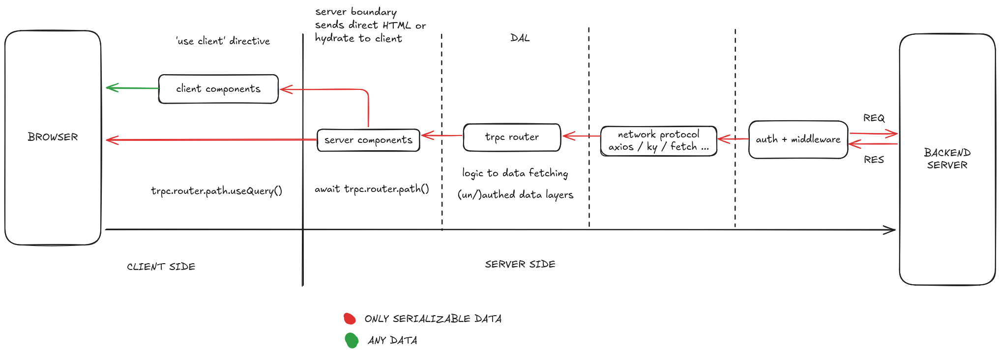

# NIW Frontend Base Next.js repository

## Getting Started

- copy the contents of `.env.example` into `.env`. Update the `.env` schema in [`env.ts`](/env.ts) as needed
- contact your senior software engineers for `AZURE_AD_*` secrets
- run the development server:

```bash
# any of these
npm run dev
yarn dev
pnpm dev
bun dev
```

Open [http://localhost:3000](http://localhost:3000) with your browser to see the result.

## Default customizations/features

### Tech stack

- Framework: [Next.js](https://nextjs.org/)
- OAuth/Authentication: [NextAuth](https://next-auth.js.org)
- DAL (Data Access Layer): [tRPC](https://trpc.io/) + [React/Tanstack Query](https://tanstack.com/query/latest)
- Network: [ky](https://github.com/sindresorhus/ky) **OR** [axios](https://axios-http.com/)
- Global state management: [jotai](https://jotai.org/)
- CSS: [Tailwind CSS](https://tailwindcss.com/)
- UI: [shadcn](https://ui.shadcn.com/) ([Radix](https://www.radix-ui.com/primitives/) with sane defaults)
- Date and time: [date-fns](https://date-fns.org/)
- I18n: [next-intl](https://next-intl.dev/)

### Extended dev params

Extra debug flags are provided out of the box. Developers can turn them on or
off to include/omit `console.log`. The debug flags are:

- `DEBUG_AUTH`: authentication session logging
- `DEBUG_MIDDLEWARE`: middleware logging
- `DEBUG_SKIP_AUTH`: whether if auth could be skipped entirely, defaults to
  `0`. Use this carefully or when you don't yet have Azure envs, then turn this
  flag on and sign in with a random pair of email/address

### Storybook

This repo is included with a set of storybook components. You can open
storybook by running

```bash
# any of these
npm run storybook
yarn storybook
pnpm storybook
bun storybook
```

### Data flow

This repo uses [trpc](https://trpc.io/docs/concepts#what-is-rpc-what-mindset-should-i-adopt) on top of [React
Query](https://tanstack.com/query/latest/docs/framework/react/overview) to
manage a data acess layer (DAL) across the whole app. This is the rough
summary of how data is acquired and served to the React Components



### Global state management

For complex components that requires a lot of states involving with each other
or have deep React tree, use the [jotai](https://jotai.org/docs) state machine
to have more fine-grained control.

### Reading materials

- [Next.js documentation](https://nextjs.org/docs)
- Most primitive UI components are headless [Radix UI](https://www.radix-ui.com/primitives/docs/overview/introduction) components with opionated [shadcn](https://ui.shadcn.com/docs/components/accordion) styling
- [trpc](https://trpc.io/docs/concepts#what-is-rpc-what-mindset-should-i-adopt)
- [React Query](https://tanstack.com/query/latest/docs/framework/react/overview)
- [jotai](https://jotai.org/docs)
